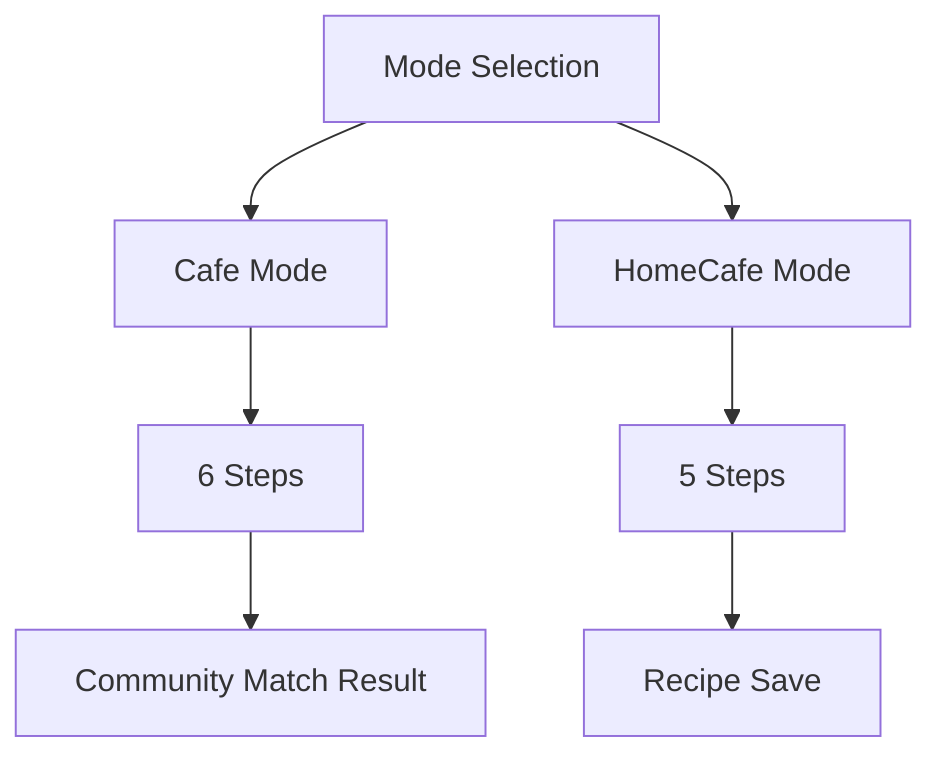
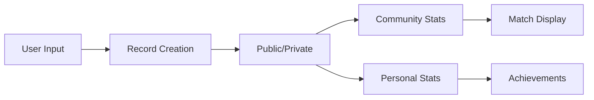

# Dependency Map (의존성 맵)

문서 간 의존성과 영향 범위를 추적하는 시스템

## 🕸 Core Dependencies

### Cafe Mode Steps Change
```yaml
trigger: "cafe_mode.steps 변경"
affected_files:
  critical:
    - /01-product-overview/core-features.md
    - /04-information-architecture/sitemap.md
    - /05-features/tasting-flow/tasting-flow-overview.md
  
  high:
    - /03-user-journey/coffee-recording-journey.md
    - /03-user-journey/recording-flow.md
    - /05-features/tasting-flow/cafe-mode/screens/*.md
  
  medium:
    - /README.md
    - /10-development-roadmap/development-roadmap.md
    - /MVP-SUMMARY.md
  
  low:
    - /02-user-personas/primary-personas.md

update_checklist:
  - [ ] Update DOCUMENT-TOKENS.md
  - [ ] Update all critical files
  - [ ] Update progress indicators
  - [ ] Update screen navigation
  - [ ] Update user journey flows
  - [ ] Verify sitemap consistency
```

### Community Features Change
```yaml
trigger: "community_features 변경"
affected_files:
  critical:
    - /09-community/community-features.md
    - /09-community/community-features-mvp.md
    - /05-features/community-match/community-match-system.md
  
  high:
    - /06-gamification/gamification-strategy.md
    - /05-features/tasting-flow/cafe-mode/screens/06-community-match.md
  
  medium:
    - /01-product-overview/product-vision.md
    - /MVP-SUMMARY.md
  
update_checklist:
  - [ ] Decide MVP vs Full scope
  - [ ] Update community screens
  - [ ] Update gamification rewards
  - [ ] Check data model impacts
```

### Gamification System Change
```yaml
trigger: "achievements/badges 변경"
affected_files:
  critical:
    - /06-gamification/gamification-strategy.md
    - /06-gamification/gamification-strategy-mvp.md
  
  high:
    - /03-user-journey/onboarding-flow.md
    - /05-features/profile/user-profile.md
  
  medium:
    - /09-community/community-features.md
    - /MVP-SUMMARY.md

update_checklist:
  - [ ] Update achievement definitions
  - [ ] Check onboarding references
  - [ ] Update profile display
  - [ ] Verify point calculations
```

## 🔗 Component Relationships

### Recording System


### Data Flow


## 📊 Impact Matrix

| Component | Files Affected | Risk Level | Test Priority |
|-----------|---------------|------------|---------------|
| Cafe Mode Steps | 15+ | High | Critical |
| Community Features | 10+ | Medium | High |
| Gamification | 8+ | Low | Medium |
| Data Models | 20+ | Critical | Critical |
| Navigation | 12+ | High | High |

## 🚨 Critical Paths

### User Journey Critical Path
```
Onboarding → First Record → Achievement → Profile
```
**Files**: onboarding-flow.md → recording-flow.md → gamification-strategy.md → user-profile.md

### Data Critical Path
```
Record Input → Validation → Storage → Stats → Display
```
**Files**: screens/*.md → data-models.md → api-spec.md → community-match.md

## 🔄 Update Protocol

### When Making Changes:
1. **Check DOCUMENT-TOKENS.md** - Is this a token value?
2. **Check DEPENDENCY-MAP.md** - What else is affected?
3. **Update TOKEN first** - Single source of truth
4. **Follow dependency tree** - Update in order of criticality
5. **Run validation** - Check all cross-references
6. **Update change log** - Document what changed

### Validation Commands (Conceptual)
```bash
# Check for inconsistencies
grep -r "cafe.*mode.*[0-9].*단계" .
grep -r "cafe.*mode.*[0-9].*steps" .

# Find all references to a token
grep -r "community_match" . --include="*.md"

# Validate cross-references
find . -name "*.md" -exec grep -l "팔로우" {} \;
```

## 📝 Change Tracking

### Recent Changes
```yaml
2025-08-08:
  - cafe_mode.steps: 7 → 6
  - community.follow_system: true → false (MVP)
  - sns_sharing: removed
  - business_model: deferred
```

### Pending Changes
```yaml
todo:
  - Consolidate data models
  - Create MVP-specific API spec
  - Align all progress indicators
```

---

**Note**: 이 맵을 참조하여 변경사항의 영향 범위를 파악하고 체계적으로 업데이트합니다.