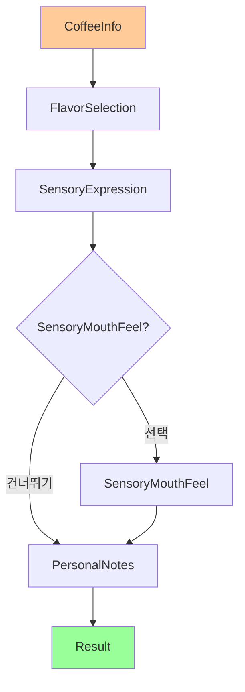

# ☕ 카페모드 유저플로우

**문서타입**: 유저플로우 가이드  
**모드명**: 카페모드 (Cafe Mode)  
**작성일**: 2025-08-01  
**문서상태**: ✅ 작성 완료  

---

## 📋 개요

**모드 설명**: 카페에서 커피를 마실 때 사용하는 간단한 테이스팅 플로우  
**주요 특징**: 빠르고 간편한 기록, 브루잉 설정 없음  
**주 사용자**: 카페 방문객, 커피 초보자, 간단히 기록하고 싶은 사용자  

---

## 🎯 플로우 구성

### 전체 화면 순서 (6단계)
```
1. CoffeeInfo (커피 정보)
2. FlavorSelection (향미 선택)
3. SensoryExpression (감각 표현)
4. SensoryMouthFeel (수치 평가) - 선택적
5. PersonalNotes (개인 노트)
6. Result (결과)
```

---

## 📱 화면별 상세 플로우

### 1️⃣ CoffeeInfo (커피 정보 입력)
**목적**: 마시는 커피와 카페 정보 기록  
**소요시간**: 1-2분  
**진행률**: 29%  

**필수 입력 항목** (Cascade 자동완성):
1. **카페명** (필수): 카페 검색 및 자동완성
2. **로스터명** (필수): 선택한 카페의 로스터 목록에서 선택
3. **커피명** (필수): 선택한 카페+로스터의 커피 목록에서 선택
4. **온도** (필수): Hot/Iced 토글 선택

**선택 정보** (Progressive Disclosure - 기본 접힘):
- 원산지
- 품종
- 가공방식
- 로스팅 레벨
- 고도 (Altitude)

**3단계 Cascade 자동완성**:
```
카페 선택 → 해당 카페의 로스터 목록 필터링
         → 선택한 로스터의 커피 목록 필터링
         → DB에 있으면 선택정보 자동입력
```

**UI 특징**:
- 🔍 Cascade 자동완성 시스템
- 📍 현재 위치 기반 카페 추천
- 🆕 새로운 커피 자동 DB 추가
- 📂 선택정보는 접기/펼치기

**다음 화면**: FlavorSelection

---

### 2️⃣ FlavorSelection (향미 선택)
**목적**: 커피에서 느낀 향미를 SCA Flavor Wheel 기준으로 기록  
**소요시간**: 1-3분 (초보자: 1분, 전문가: 3분)  
**진행률**: 57%  

**선택 방식**:
- **최소 1개 이상** 향미 선택 필요 (권장 3개 이상)
- **3단계 계층 구조**: 대분류(9) → 중분류 → 소분류(총 85개)
- **Level 2 중심 선택**: 중분류 선택 후 원하면 소분류 구체화
- 🔍 **검색 기능**: 85개 향미 중 빠른 찾기

**향미 카테고리** (9개 대분류, 85개 향미):
- 🍓 **과일향/프루티** (16개): 베리류, 시트러스, 건조과일, 기타과일
- 🍋 **신맛/발효** (11개): 신맛, 알코올/발효
- 🌿 **초록/식물성** (11개): 올리브오일, 허브/식물성, 콩비린내
- 📦 **기타** (14개): 종이/곰팡이, 화학물질
- 🔥 **로스팅** (8개): 파이프담배, 탄내/스모키, 곡물
- 🌶️ **향신료** (6개): 자극적/펀전트, 갈색 향신료
- 🥜 **견과류/코코아** (5개): 견과류, 초콜릿향
- 🍯 **단맛** (9개): 캐러멜, 바닐라, 전반적 단맛
- 🌺 **꽃향기/플로럴** (4개): 홍차, 꽃향기

**인기 향미** (상단 빠른 선택):
베리류, 초콜릿향, 캐러멜향, 견과류, 시트러스, 바닐라

**다음 화면**: SensoryExpression

---

### 3️⃣ SensoryExpression (한국어 감각 표현)
**목적**: 커피의 맛과 느낌을 한국어 네이티브 표현으로 기록  
**소요시간**: 2-3분  
**진행률**: 75%  

**선택 방식**: 
- **CATA(Check All That Apply)** 방식 - 부담 없는 다중 선택
- **카테고리별 최대 3개**씩 선택 가능
- **Progressive Disclosure**: 카테고리별 접기/펼치기

**6개 카테고리 × 7개 표현 = 44개 한국어 체계**:

🍋 **산미 (Acidity)** - 7개
- 싱그러운, 발랄한, 톡 쏘는, 상큼한
- 과일 같은, 와인 같은, 시트러스 같은

🍯 **단맛 (Sweetness)** - 7개
- 농밀한, 달콤한, 꿀 같은, 캐러멜 같은
- 설탕 같은, 당밀 같은, 메이플 시럽 같은

🌰 **쓴맛 (Bitterness)** - 7개
- 스모키한, 카카오 같은, 허브 느낌의, 고소한
- 견과류 같은, 다크 초콜릿 같은, 로스티한

💧 **바디 (Body)** - 7개
- 크리미한, 벨벳 같은, 묵직한, 가벼운
- 실키한, 오일리한, 물 같은

🌬️ **애프터 (Aftertaste)** - 7개
- 깔끔한, 길게 남는, 산뜻한, 여운이 좋은
- 드라이한, 달콤한 여운의, 복합적인

⚖️ **밸런스 (Balance)** - 7개
- 조화로운, 부드러운, 자연스러운, 복잡한
- 단순한, 안정된, 역동적인

**UI 특징**:
- 카테고리별 색상 시스템
- 실시간 선택 카운터
- 선택된 표현 요약 프리뷰

**다음 화면**: SensoryMouthFeel 또는 PersonalNotes

---

### 4️⃣ SensoryMouthFeel (수치 평가) - 선택적 ⭐
**목적**: 6개 감각을 1-5 스케일로 정량 평가 (건너뛰기 가능)  
**소요시간**: 2-3분 또는 즉시 건너뛰기  
**진행률**: 85%  

**평가 항목** (6개, 각 1-5점, 1 단위):

1. **Body (바디감)** - 커피의 무게감과 질감
   - 1점: 물 같이 가벼움
   - 3점: 적당한 바디감 (기본값)
   - 5점: 크리미하고 매우 묵직함

2. **Acidity (산미)** - 밝고 상쾌한 산미의 강도
   - 1점: 산미 거의 없음
   - 3점: 적당한 산미 (기본값)
   - 5점: 강하고 복잡한 산미

3. **Sweetness (단맛)** - 자연스러운 단맛의 정도
   - 1점: 단맛 부족
   - 3점: 은은한 자연 단맛 (기본값)
   - 5점: 매우 풍부한 단맛

4. **Finish (여운)** - 맛이 지속되는 시간과 품질
   - 1점: 여운이 짧음
   - 3점: 적당한 길이의 여운 (기본값)
   - 5점: 매우 길고 복합적인 여운

5. **Bitterness (쓴맛)** - 쓴맛의 강도와 품질
   - 1점: 쓴맛 거의 없음
   - 3점: 적당하고 균형잡힌 쓴맛 (기본값)
   - 5점: 강하지만 불쾌하지 않은 쓴맛

6. **Balance (밸런스)** - 전체적인 조화와 균형
   - 1점: 특정 요소가 과도함
   - 3점: 무난한 균형감 (기본값)
   - 5점: 모든 요소가 완벽하게 조화

**UI 특징**:
- 💡 모든 항목 3점 기본값으로 시작
- 📊 실시간 총점/평균 계산 (6-30점)
- 🔝 강점/약점 자동 하이라이트
- 💬 점수 패턴 기반 자동 코멘트
- ⏭️ 헤더와 하단에 건너뛰기 옵션

**다음 화면**: PersonalNotes

---

### 5️⃣ PersonalNotes (개인 노트)
**목적**: 자유로운 감상과 메모로 정성적 데이터 수집  
**소요시간**: 1-2분  
**진행률**: 94%  

**입력 요소**:

#### 📝 메인 텍스트 입력 (200자 제한)
- 다중 라인 텍스트 에리어
- 실시간 글자 수 카운터 (예: 15/200)
- 10초마다 자동 저장
- 플레이스홀더: "예) 아침에 마시기 좋은 부드러운 맛이었다..."

#### 💬 빠른 입력 도구 (8개)
- "아침에 좋을 것 같다"
- "다시 마시고 싶다"
- "친구에게 추천하고 싶다"
- "특별한 날에 어울린다"
- "집중할 때 좋을 것 같다"
- "편안한 느낌이다"
- "새로운 경험이었다"
- "기대보다 좋았다"

#### 😊 감정 태그 (9개)
- 😊 만족, 😍 최고, 😌 편안함
- 🤔 흥미로움, 😋 맛있음, ✨ 특별함
- 💭 생각나는, 🎯 집중, ☕ 일상

#### ⏰ 컨텍스트 정보 (자동 수집)
- 작성 시간: 오전/오후/저녁/밤

**특징**: 완전 선택적 - 빈 상태로도 다음 진행 가능

**다음 화면**: Result

---

### 6️⃣ Result (결과)
**목적**: 테이스팅 완료 결과 표시 및 재참여 유도  
**진행률**: 100% 완료  

**표시 내용**:

#### 📋 커피 정보 요약
- 커피명, 카페명, 완료 시간

#### 🔍 로스터 vs 나의 선택 비교 ⭐핵심 기능
- **로스터 노트 입력**: 결과 화면에서 직접 입력 가능
- **비교 점수**: XX% 일치
- **향미 매칭**: X개 중 Y개 일치
- **감각 표현**: 로스터 노트와 XX% 일치
- **비교 차트**: 벤다이어그램 또는 매트릭스
- **인사이트**: "산미 감지 능력이 뛰어나시네요!"

#### 💯 Match Score
- 전체 매치 점수: XX%
- 수준별 메시지: 초보자/중급자/전문가

#### 🎯 개인 테이스팅 요약
- 선택한 향미 (FlavorSelection)
- 감각 표현 (SensoryExpression)
- 수치 평가 (SensoryMouthFeel - 있는 경우)
- 개인 노트 (PersonalNotes)

#### 🏆 성장 인사이트
- 누적 테이스팅 수
- 자주 감지하는 향미 패턴
- 개인 취향 분석

**액션 버튼**:
- 📱 결과 공유 (SNS/메신저)
- ⭐ 카페 즐겨찾기 추가
- ➕ 새로운 테이스팅 시작

---

## 🔄 플로우 다이어그램



---

## 💡 카페모드 특별 기능

### 1. 빠른 기록
- 홈카페모드 대비 단계 축소 (브루잉 설정 생략)
- 필수 항목만으로 8-12분 내 완료
- 카페에서 빠르게 기록 가능

### 2. 카페 중심 기능
- 카페별 커피 히스토리
- 즐겨찾는 카페 관리
- 카페 추천 시스템

### 3. 초보자 친화
- 간단한 UI/UX
- 쉬운 용어 사용
- 부담 없는 기록

---

## 📊 예상 소요 시간

### 최소 경로 (필수만): 약 8-12분
```
CoffeeInfo (2-3분) → FlavorSelection (2분) → 
SensoryExpression (2-3분) → PersonalNotes (1분) → Result (2분)
```

### 전체 경로 (모든 단계): 약 12-18분
```
CoffeeInfo (3-4분) → FlavorSelection (3-4분) → 
SensoryExpression (3-4분) → SensoryMouthFeel (3-5분) → 
PersonalNotes (2-3분) → Result (3-4분)
모든 선택적 단계 포함 + 상세 입력
```

### 건너뛰기 최적화: 약 6-8분
```
CoffeeInfo (1분) → FlavorSelection (빠른 선택) → 
SensoryExpression (최소 선택) → PersonalNotes (건너뛰기) → Result
```

---

## 🎯 핵심 가치

1. **간편한 기록**: 카페에서 빠르게 테이스팅 기록
2. **카페 탐방 기록**: 다양한 카페의 커피 경험 축적
3. **취향 발견**: 좋아하는 커피 스타일 파악
4. **커피 입문**: 초보자도 쉽게 시작할 수 있는 테이스팅

---

## 🔀 홈카페모드와의 차이점

| 구분 | 카페모드 | 홈카페모드 |
|------|---------|------------|
| 단계 수 | 6단계 | 7단계 |
| 브루잉 설정 | ❌ 없음 | ✅ 있음 |
| 소요 시간 | 5-7분 | 8-12분 |
| 주요 목적 | 카페 탐방 기록 | 레시피 실험 |
| 주 사용자 | 커피 초보자 | 홈바리스타 |

---

**✅ 문서 완성**: 카페모드 유저플로우 TF_Screen 문서 반영 완료  
**📋 업데이트 내역**: TF_Screen 문서들의 상세 내용 통합  
**🔗 관련 문서**: UserFlow_HomeCafeMode.md, TF_Screen_*.md 시리즈  
**📝 변경이력**: 
- 2025-08-01: 초기 작성
- 2025-08-01: TF_Screen 문서 내용 상세 반영