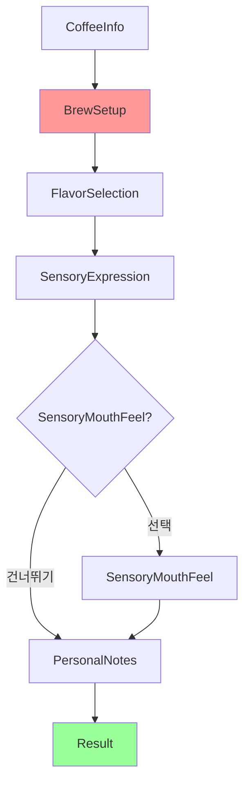

# 🏠 홈카페모드 유저플로우

**문서타입**: 유저플로우 가이드  
**모드명**: 홈카페모드 (HomeCafe Mode)  
**작성일**: 2025-08-01  
**문서상태**: ✅ TF_Screen 문서 반영 완료  

---

## 📋 개요

**모드 설명**: 집에서 직접 커피를 내리는 사용자를 위한 테이스팅 플로우  
**주요 특징**: 브루잉 설정 기록 + 테이스팅 기록을 함께 저장  
**주 사용자**: 홈바리스타, 핸드드립 애호가, 커피 레시피 실험가  
**예상 소요시간**: 최소 14-25분, 일반적 20-35분, 전체 25-45분 (브루잉 시간 포함)  

---

## 🎯 플로우 구성

### 전체 화면 순서 (7단계)
```
1. CoffeeInfo (커피 정보) - 29% 진행률
2. BrewSetup (브루잉 설정) ⭐홈카페모드 전용 - 43% 진행률  
3. FlavorSelection (향미 선택) - 57% 진행률
4. SensoryExpression (감각 표현) - 71% 진행률
5. SensoryMouthFeel (수치 평가) - 선택적 - 86% 진행률
6. PersonalNotes (개인 노트) - 100% 진행률
7. Result (결과) - 100% 완료
```

---

## 📱 화면별 상세 플로우

### 1️⃣ CoffeeInfo (커피 정보 입력)
**목적**: 어떤 원두로 커피를 내리는지 기록  
**소요시간**: 1-2분  
**진행률**: 29%  

**필수 입력 항목** (2단계 Cascade 자동완성):
1. **로스터명** (필수): 로스터 검색 및 자동완성
2. **커피명** (필수): 선택한 로스터의 커피 목록에서 선택
3. **온도** (필수): Hot/Iced 토글 선택

**선택 정보** (Progressive Disclosure - 기본 접힘):
- 원산지
- 품종
- 가공방식
- 로스팅 레벨
- 고도 (Altitude)

**2단계 Cascade 자동완성** (카페명 없음):
```
로스터 선택 → 해당 로스터의 커피 목록 필터링
          → DB에 있으면 선택정보 자동입력
```

**UI 특징**:
- 🔍 Cascade 자동완성 시스템
- 🏠 카페명 입력 없음 (홈카페모드 특징)
- 🆕 새로운 커피 자동 DB 추가
- 📂 선택정보는 접기/펼치기

**다음 화면**: BrewSetup

---

### 2️⃣ BrewSetup (브루잉 설정) ⭐홈카페모드 전용
**목적**: 집에서 커피를 내린 방법과 레시피 기록  
**소요시간**: 2-3분  
**진행률**: 43%  

**입력 항목**:

#### 드리퍼 선택 (4종)
- **V60**: 가장 인기 있는 드리퍼
- **Kalita Wave**: 안정적 추출
- **Origami**: 다재다능함
- **April**: 균형 잡힌 맛

#### 레시피 설정 (6-Field)
1. **비율 프리셋** (7개 세분화)
   - 1:15 (진한 맛)
   - 1:15.5
   - 1:16 (균형)
   - 1:16.5
   - 1:17 (순한 맛)
   - 1:17.5
   - 1:18 (가벼운 맛)

2. **키패드 입력 시스템**
   - 원두량: 직접 입력 (기본값 20g)
   - 물량: 자동 계산 표시

3. **물 온도**: 입력 필드 (°C)

4. **분쇄도 세팅**: "브랜드, 모델, 세팅" 직접 입력
   - 예: "코만단테, C40 MK4, 25 클릭"

5. **추출 타이머**
   - 1차 추출 시간: 블룸 시간 (초)
   - 총 시간: 시작/정지 버튼
   - 랩타임: 다단계 기록

6. **간단 노트**: 한 줄 메모

**특별 기능**: "나의 커피" 레시피 저장/불러오기

**다음 화면**: FlavorSelection

---

### 3️⃣ FlavorSelection (향미 선택)
**목적**: 커피에서 느낀 향미 기록  
**소요시간**: 1-3분 (초보자: 1분, 전문가: 3분)  
**진행률**: 57%  

**선택 방식**:
- **최소 1개 이상** 향미 선택 필요 (권장 3개 이상)
- **3단계 계층 구조**: 대분류 → 중분류 → 소분류
- **검색 기능**으로 빠른 찾기
- **인기 향미**: 베리류, 초콜릿향, 캐러멜향, 견과류, 시트러스, 바닐라

**향미 카테고리** (9개 대분류, 85개 향미):
- 🍓 **과일향/프루티**: 베리류, 시트러스, 건조과일, 기타과일
- 🍋 **신맛/발효**: 신맛, 알코올/발효
- 🌿 **초록/식물성**: 올리브오일, 허브/식물성, 콩비린내
- 📦 **기타**: 종이/곰팡이, 화학물질
- 🔥 **로스팅**: 파이프담배, 탄내/스모키, 곡물/구운빵
- 🌶️ **향신료**: 자극적/펀전트, 갈색 향신료
- 🥜 **견과류/코코아**: 견과류, 초콜릿향
- 🍯 **단맛**: 캐러멜/갈색설탕, 바닐라, 전반적 단맛
- 🌺 **꽃향기/플로럴**: 홍차, 꽃향기

**다음 화면**: SensoryExpression

---

### 4️⃣ SensoryExpression (한국어 감각 표현)
**목적**: 커피의 맛과 느낌을 한국어로 표현  
**소요시간**: 2-3분  
**진행률**: 71%  

**선택 방식**: CATA(Check All That Apply) - 부담 없는 다중 선택  
**카테고리별 최대 3개**까지 선택 가능  

**6개 카테고리 × 7개 표현 = 44개 체계**:

#### 🍋 산미 (Acidity)
- 싱그러운, 발랄한, 톡 쏘는, 상큼한
- 과일 같은, 와인 같은, 시트러스 같은

#### 🍯 단맛 (Sweetness)  
- 농밀한, 달콤한, 꿀 같은, 캐러멜 같은
- 설탕 같은, 당밀 같은, 메이플 시럽 같은

#### 🌰 쓴맛 (Bitterness)
- 스모키한, 카카오 같은, 허브 느낌의, 고소한
- 견과류 같은, 다크 초콜릿 같은, 로스티한

#### 💧 바디 (Body)  
- 크리미한, 벨벳 같은, 묵직한, 가벼운
- 실키한, 오일리한, 물 같은

#### 🌬️ 애프터 (Aftertaste)
- 깔끔한, 길게 남는, 산뜻한, 여운이 좋은
- 드라이한, 달콤한 여운의, 복합적인

#### ⚖️ 밸런스 (Balance)
- 조화로운, 부드러운, 자연스러운, 복잡한
- 단순한, 안정된, 역동적인

**UI 특징**: Progressive Disclosure (카테고리별 접기/펼치기)

**다음 화면**: SensoryMouthFeel 또는 PersonalNotes

---

### 5️⃣ SensoryMouthFeel (수치 평가) - 선택적
**목적**: 감각을 1-5 스케일로 정량 평가 (건너뛰기 가능)  
**소요시간**: 2-3분 또는 즉시 건너뛰기  
**진행률**: 86%  

**평가 항목** (6개, 각 1-5점, 1 단위):
1. **Body (바디감)**: 커피의 무게감과 질감
   - 1점: 물 같이 가벼움
   - 3점: 적당한 바디감 (기본값)
   - 5점: 크리미하고 매우 묵직함

2. **Acidity (산미)**: 밝고 상쾌한 산미의 강도
   - 1점: 산미 거의 없음
   - 3점: 적당한 산미 (기본값)
   - 5점: 강하고 복잡한 산미

3. **Sweetness (단맛)**: 자연스러운 단맛의 정도
   - 1점: 단맛 부족
   - 3점: 은은한 자연 단맛 (기본값)
   - 5점: 매우 풍부한 단맛

4. **Finish (여운)**: 맛이 지속되는 시간과 품질
   - 1점: 여운이 짧음
   - 3점: 적당한 길이의 여운 (기본값)
   - 5점: 매우 길고 복합적인 여운

5. **Bitterness (쓴맛)**: 쓴맛의 강도와 품질
   - 1점: 쓴맛 거의 없음
   - 3점: 적당하고 균형잡힌 쓴맛 (기본값)
   - 5점: 강하지만 불쾌하지 않은 쓴맛

6. **Balance (밸런스)**: 전체적인 조화와 균형
   - 1점: 특정 요소가 과도함
   - 3점: 무난한 균형감 (기본값)
   - 5점: 모든 요소가 완벽하게 조화

**특별 기능**:
- 💡 **스마트 기본값**: 모든 항목 3점으로 시작
- 📊 **실시간 피드백**: 총점/평균/강점/약점 자동 표시
- 💬 **자동 코멘트**: 점수 패턴 기반 간단 해석
- ⏭️ **건너뛰기**: 헤더와 하단에 건너뛰기 옵션 제공

**다음 화면**: PersonalNotes

---

### 6️⃣ PersonalNotes (개인 노트)
**목적**: 자유로운 감상과 메모  
**소요시간**: 1-2분  
**진행률**: 100%  

**입력 요소**:

#### 메인 텍스트 입력 (200자 제한)
- 다중 라인 텍스트
- 실시간 글자 수 카운터
- 10초마다 자동 저장

#### 빠른 입력 도구 (8개)
- "아침에 좋을 것 같다"
- "다시 마시고 싶다"
- "친구에게 추천하고 싶다"
- "특별한 날에 어울린다"
- "집중할 때 좋을 것 같다"
- "편안한 느낌이다"
- "새로운 경험이었다"
- "기대보다 좋았다"

#### 감정 태그 (9개)
- 😊 만족, 😍 최고, 😌 편안함
- 🤔 흥미로움, 😋 맛있음, ✨ 특별함
- 💭 생각나는, 🎯 집중, ☕ 일상

**특징**: 완전 선택적 - 빈 상태로도 다음 진행 가능

**다음 화면**: Result

---

### 7️⃣ Result (결과)
**목적**: 테이스팅 완료 및 결과 확인  
**진행률**: 100% 완료  

**표시 내용**:

#### 📋 커피 정보 요약
- 커피명, 로스터리, 완료 시간

#### 🔧 브루잉 레시피 요약 ⭐홈카페모드 특화
- 드리퍼, 비율, 온도, 분쇄도, 추출 시간

#### 🔍 로스터 vs 나의 선택 비교
- 로스터 노트 입력 섹션 (선택적)
- 비교 점수: XX% 일치
- 향미 매칭: X개 중 Y개 일치
- 감각 표현: 로스터 노트와 XX% 일치
- 비교 차트: 벤다이어그램 또는 매트릭스
- 인사이트: "산미 감지 능력이 뛰어나시네요!"

#### 💯 Match Score
- 전체 매치 점수: XX%
- 맞춤 메시지 표시

#### 🎯 개인 테이스팅 요약
- 선택한 향미, 감각 표현
- 수치 평가 (있는 경우)
- 개인 노트

#### 🏆 성장 인사이트
- 새로운 성취, 개인 통계
- 맞춤 인사이트

**액션 버튼**:
- 레시피 저장 ("나의 레시피"에 추가)
- 결과 공유
- 새로운 테이스팅 시작

---

## 🔄 플로우 다이어그램



---

## 💡 홈카페모드 특별 기능

### 1. 레시피 저장 및 관리
- 성공적인 레시피는 "나의 커피"에 저장
- AsyncStorage 기반 영구 저장
- 같은 원두로 다른 레시피 실험 기록
- 레시피별 결과 비교

### 2. 브루잉 변수 추적
- 동일 원두의 다양한 추출 방법 비교
- 최적 레시피 찾기
- 추출 변수와 맛의 상관관계 분석
- 분쇄도 세팅까지 포함한 정밀 기록

### 3. 개인 성장 추적
- 홈바리스타 레벨 시스템
- 추출 일관성 향상도
- 향미 감지 능력 발전
- 로스터 비교를 통한 객관적 성장 확인

---

## 📊 예상 소요 시간

### 최소 경로 (필수만 + 최대 건너뛰기): 약 14-25분
```
CoffeeInfo (2분) + BrewSetup (5분) + FlavorSelection (2분) + 
SensoryExpression (2분) + PersonalNotes (즉시) + Result (2분) = 13분
+ 실제 브루잉 과정 고려 시: 18-25분
```

### 일반적 경로 (대부분 완료): 약 20-35분
```
CoffeeInfo (3분) + BrewSetup (8분) + FlavorSelection (3분) + 
SensoryExpression (3분) + SensoryMouthFeel (3분) + PersonalNotes (2분) + Result (3분) = 25분
+ 브루잉 시간 포함: 30-35분
```

### 전체 경로 (모든 단계 완전): 약 25-45분
```
CoffeeInfo (4분) + BrewSetup (12분) + FlavorSelection (5분) + 
SensoryExpression (4분) + SensoryMouthFeel (5분) + PersonalNotes (3분) + Result (5분) = 38분
+ 여유 시간 포함: 40-45분
```

---

## 🎯 핵심 가치

1. **레시피 실험 기록**: 매번 다른 추출 변수 시도 및 정밀 기록
2. **맛의 재현성**: 분쇄도까지 포함한 상세 레시피로 재현 가능
3. **성장 과정 추적**: 홈바리스타로서의 실력 향상 객관적 확인
4. **커피 이해도 증진**: 추출 변수가 맛에 미치는 영향 체계적 학습

---

**✅ 문서 완성**: 홈카페모드 유저플로우 업데이트 완료  
**📋 업데이트 내역**: TF_Screen 문서들의 상세 내용 반영  
**🔗 관련 문서**: TF_Screen_*.md 시리즈, UserFlow_CafeMode.md  
**📝 변경이력**: 
- 2025-08-01: 초기 작성
- 2025-08-01: TF_Screen 문서 내용 상세 반영